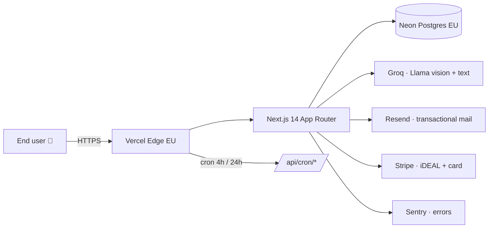

# DeGeldHeld

> Automatisch onderhandelen op je Nederlandse maandlasten via AI.
> Eerste onderhandeling gratis, daarna € 4,99 per dossier.

**Status: v7 LIVE** — Beat-Trim sprint complete: PDF support, demo mode,
referral viral loop, 30 + 4 SEO landing pages, mail-feedback dashboard,
deep `/api/health`, full per-category vergelijking (energie/verz/hyp).
Zie [STATUS_V7.md](./STATUS_V7.md) voor het sprint-rapport.

## Feature table

| Capability | Status |
|---|---|
| Bill upload (JPG/PNG) + OCR via Groq vision (llama-4-scout) | stable |
| Bill upload (PDF) via pdfjs text extraction → llama-3.3-70b | **new v7** |
| Provider/category/amount extraction | stable |
| Market comparison (14 categories, NL + EU providers) | stable |
| AI onderhandel-email generation | stable |
| Multi-round negotiation flow | stable |
| 7-day outcome follow-up cron | stable |
| Dashboard + per-user history | stable |
| Public track record (`/proof`) | stable |
| Rate limiting on expensive APIs | stable (v6) |
| Centralised Zod validation on all mutations | stable (v6) |
| Global error boundaries + Sentry pipeline | stable (v6) |
| Trust pages: /privacy /voorwaarden /over-ons /contact | stable (v6) |
| Per-bill paywall (€4,99 after the first free bill) | stable |
| AVG-erkenning + WCAG 2.1 AA contrast | stable |
| Demo mode (3 voorbeeld-facturen, geen account) | **new v7** |
| Referral viral loop (`/uitnodiging/[code]` + dashboard share) | **new v7** |
| Deep `/api/health` (db + groq + resend + stripe) | **new v7** |
| Mail-quality feedback dashboard (`/proof?view=mail-quality`) | **new v7** |
| Per-category vergelijking (energie/verz/hyp) | **new v7** |
| 30 provider + 4 category SEO landing pages | **new v7** |
| 1080×1920 IG-story PNG + share kit op /uitkomst | **new v7** |

## Wat we anders doen dan Trim

| | Trim | DeGeldHeld v7 |
|---|---|---|
| Categorieën | Subscription cancel | Telecom + Energie + Verzekering + Hypotheek deep-compare |
| Multi-round | 1 call, klaar | Tot 3 rondes met AI-counter-mail |
| Transparency | Black box | Open `/proof` + mail-rating + open prompts |
| Distributie | Bank-koppeling required | Demo, referral, SEO, social share |
| Pricing | 33% recurring | 10% éénmalig of €4,99 flat |
| EU/AVG | Niet beschikbaar | Privacy/voorwaarden/cookie-banner native |
| Feedback loop | Geen | Per mail 👍/👎 + provider-response tracking |
| Monitoring | Onbekend | Sentry + health + uptime + Vercel analytics |

## Tech stack



## Quickstart

```bash
git clone <this-repo> degeldheld && cd degeldheld
npm install
cp .env.example .env.local       # fill in secrets
npx prisma migrate dev
npm run dev                      # http://localhost:3000
```

## Scripts

| Command | Purpose |
|---------|------|
| `npm run dev` | Next dev server |
| `npm run build` | Production build |
| `npm test -- --run` | Vitest, single pass |
| `npm run smoke` | F0 pre-deploy smoke (env + prisma + tsc + vitest) |
| `npm run smoke:prod` | 20 production health checks (v7) |
| `npx tsx scripts/audit-routes.ts` | Production route 404/500 sweep |
| `npx tsx scripts/audit-everything.ts` | Pages + APIs combined audit (v7) |
| `npx tsx scripts/verify-providers.ts` | DNS MX + HEAD check op retentie-contacts |
| `npx tsx scripts/prompt-tuner.ts` | Nightly mail-feedback rapport (30d window) |
| `npx tsx scripts/setup-uptime.ts` | UptimeRobot monitor provisioning |
| `npx tsx scripts/mobile-audit.ts` | 375×812 Playwright mobile audit |
| `npx tsx scripts/a11y-audit.ts` | WCAG 2.1 AA axe-core sweep |
| `npm run prisma:migrate` | DB migration in dev |
| `npm run prisma:deploy` | DB migration in prod (after `npm install`) |
| `npm run seed` | Seed market_db with NL providers |

## Architecture

```
app/
  page.tsx              landing (Hero + Org/WebSite JSON-LD)
  login/                magic link (NextAuth + Resend)
  dashboard/            user savings overview
  onderhandel/          bill upload → analyse → email gen flow
  pay/[id]/             dual flow: paywall (Bill) + success-fee (Negotiation)
  privacy/  voorwaarden/  over-ons/  contact/   trust pages
  api/
    auth/               NextAuth handler
    waitlist/           email signup (3/h per IP)
    bills/upload/       multipart upload + OCR (5/h per user)
    negotiations/round/ multi-round (10/h per user)
    providers/discover/ web-fetch provider lookup (5/day per user)
    checkout/           Stripe checkout (paywall + success-fee)
    cron/follow-up/     4h follow-up emails (Bearer guard)
    cron/outcome-followup/  daily outcome ask (Bearer guard)
    webhooks/stripe/    payment events
    health/             /api/health (10s SWR)
    proof/              public anonymised track record (300s SWR)
    og/                 1200×630 OG card renderer (edge runtime)
  sitemap.ts robots.ts  SEO foundation
  error.tsx + per-tree error.tsx + global-error.tsx
components/             React UI; CookieBanner, ErrorBoundary, PaywallButton
lib/
  env.ts                zod env validation
  db.ts                 Prisma singleton
  ocr.ts                Groq Vision OCR
  market_db.ts          provider tarief lookup
  comparison.ts         goedkoper-alternatief logic
  negotiator.ts         Groq email gen
  payments.ts           Stripe success-fee + paywall
  email.ts              Resend wrapper
  rate-limit.ts         sliding-window in-memory
  schemas/              centralised Zod
prisma/
  schema.prisma         models, enums + composite indexes (state,emailSentAt) + (userId,createdAt)
scripts/                smoke, audits, seed
tests/                  vitest, ~880 tests
```

## Deploy

See [DEPLOY.md](./DEPLOY.md) for Vercel deploy steps. See
[RUNBOOK.md](./RUNBOOK.md) for env vars, migrations, cron jobs and
incident response.

## Track record

`/api/proof` returns anonymised savings stats (totaal bespaard, gemiddeld
per onderhandeling, success rate). Source of truth for marketing claims.

## License

Proprietary SaaS — © 2026 DeGeldHeld B.V.
